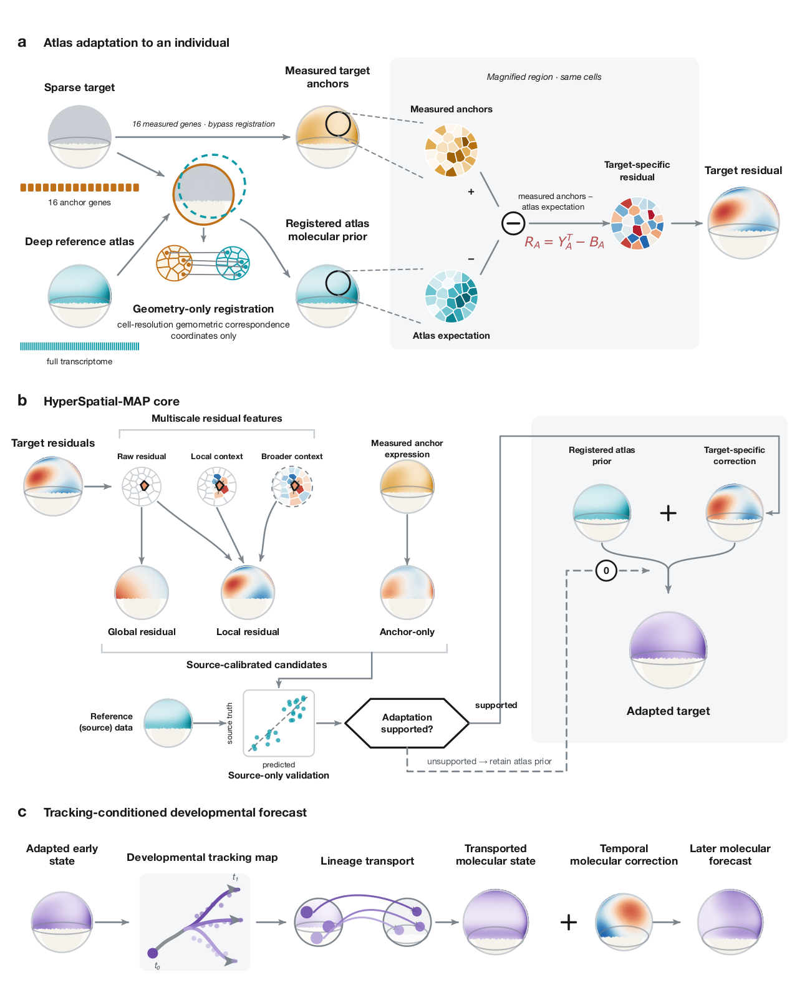

# HyperSpatial-MAP

**Sparse measurements adapt a deeply measured spatial atlas toward the molecular state of an individual specimen.**

HyperSpatial-MAP is an atlas-adaptation framework for spatial omics:

> registered atlas prior + sparse target adaptation = individualized molecular reconstruction

The reference and target are distinct specimens, sections, stages, or technologies. Geometry-only registration transfers the reference atlas, a small prespecified target panel informs an atlas-relative residual model, and a source-validation guard retains registered 12-nearest-neighbour inverse-distance weighting (IDW) when correction is unsupported.

## Overview

[](docs/assets/Figure_1.pdf)

[Open the publication-quality Figure 1 PDF](docs/assets/Figure_1.pdf)

## Repository scope

This is the **software repository**. It contains the installable package, command-line interface, reusable preprocessing/data contracts, deterministic fixtures, tests, documentation, and compact tutorials.

The separate [HyperSpatial-MAP reproducibility repository](https://github.com/sumeer1/HyperSpatial-MAP-reproducibility) contains the manuscript-scale executed workflows, frozen configurations, evidence tables, source-panel SVGs, checksums, and figure provenance. Final manual Inkscape assemblies are kept outside both computational repositories; the reproducibility record traces every final panel to its generated source asset and workflow.

See [REPOSITORY_SCOPE.md](REPOSITORY_SCOPE.md) for the boundary between the two repositories.

## Installation

Python 3.10–3.11 is supported.

```bash
git clone https://github.com/sumeer1/HyperSpatial-MAP.git
cd HyperSpatial-MAP
conda env create -f environment.yml
conda activate hyperspatial-map
python -m pip install -e .
```

Or install directly with pip:

```bash
python -m pip install .
```

## Five-minute example

```python
import hyperspatial as hs
from hyperspatial.io import read_reference, read_target

reference = read_reference("examples/minimal_2d/reference.h5ad")
panel = hs.design_panel(reference, budget=8)
target = read_target("examples/minimal_2d/target.h5ad", panel.genes)

result = hs.adapt(
    reference=reference,
    target=target,
    measured_genes=panel.genes,
    config=hs.AdaptConfig(registration="pre_registered", seeds=(42,)),
)
result.export("adaptation_run")
```

The bundled fixtures are deterministic synthetic examples for software testing, not manuscript evidence.

## Tutorials

- [Quickstart](notebooks/00_quickstart.ipynb)
- [Source-only sparse-panel design](notebooks/01_design_sparse_panel.ipynb)
- [3D specimen adaptation](notebooks/02_adapt_3d_specimen.ipynb)
- [Atlas-relative residual exploration](notebooks/03_explore_target_specific_residuals.ipynb)
- [Tracking-conditioned forecasting](notebooks/04_forecast_with_MAPT.ipynb)
- [2D Visium adaptation](notebooks/05_adapt_2d_visium.ipynb)
- [Figure 2 frozen-evidence walkthrough](notebooks/06_figure2_evidence_walkthrough.ipynb)

The Figure 2 walkthrough reads a small, immutable summary extract. It does not retrain the model or reproduce the manual manuscript layout.

## Data and preprocessing

- [Input formats and validation](docs/data_formats.md)
- [Preprocessing boundary](preprocessing/README.md)
- [Dataset accessions](data/DATASETS.tsv)
- [External-artifact policy](data/EXTERNAL_ARTIFACT_POLICY.md)

Manuscript-scale provider matrices and prediction arrays are not redistributed through GitHub. Dataset-specific executed preprocessing is archived in the reproducibility repository.

## Tests and quality checks

```bash
pytest -m 'not regression'
python scripts/execute_notebooks.py --smoke
python scripts/build_release_manifest.py
python scripts/verify_release.py
ruff check src tests scripts
```

## Scientific guardrails

- Geometry registration excludes target molecular expression.
- Only declared target anchors are available during prediction.
- Target non-anchor expression is withheld until predictions are serialized and locked.
- Predictor selection, calibration, and fallback use source validation rather than target outcomes.
- Registered IDW predicts no atlas-relative correction; its residual correlation is undefined, not zero.
- Genes and spots are technical evaluation units and do not create biological replication.
- Atlas-relative residuals are not automatically biological, causal, or clinically predictive.

See [scientific guardrails](docs/scientific_guardrails.md) and [statistical units](docs/statistical_units.md).

## Citation and license

Citation metadata are provided in [CITATION.cff](CITATION.cff). Code is distributed under the BSD 3-Clause License. External datasets retain their original licences and terms.
